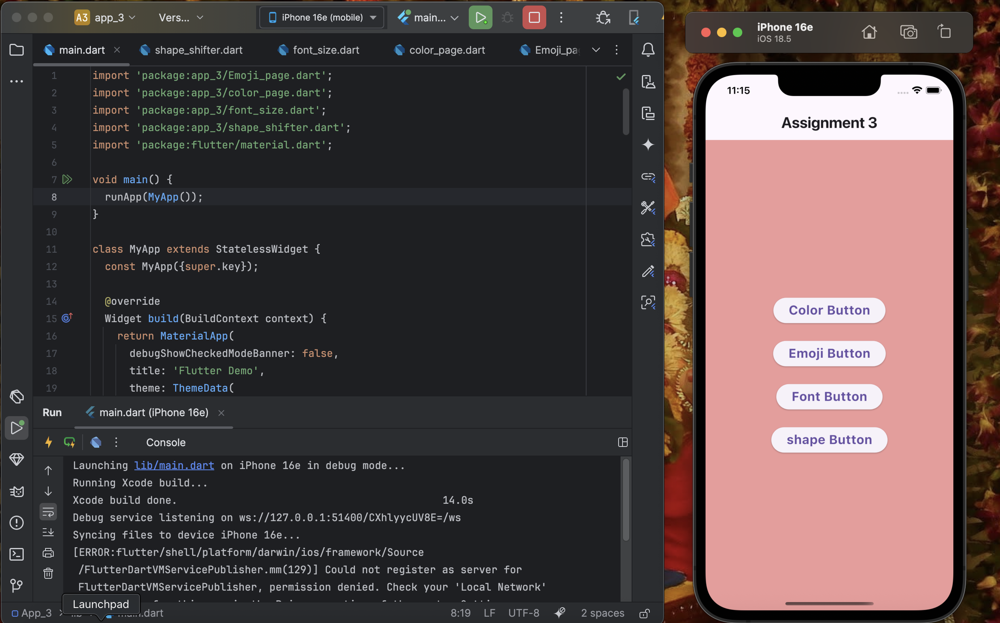

# App_3 (Flutter)

This project is a fun and creative counter app built with **Flutter** and **Dart**.  
It demonstrates how to use the **`setState()`** method in stateful widgets to dynamically rebuild the UI in an interactive way.  

## 🎯 Objective
The assignment focuses on strengthening the understanding of:
- Stateful Widgets  
- Updating UI using `setState()`  
- Making Flutter apps more engaging and interactive  

## 🛠️ Features
This app goes beyond the traditional counter by adding a **creative twist**.  
Example twist ideas implemented in this app:
- 🎨 **Color Change Counter** → Each tap changes the background color randomly.  
- 😀 **Emoji Mood Counter** → Displays different emojis based on the counter value.  
- 🔲 **Shape Switcher** → Changes the shape of a container on each button press.  
- 🔠 **Font Size Grower** → Dynamically increases/decreases text size.

## 📱 Screenshots

